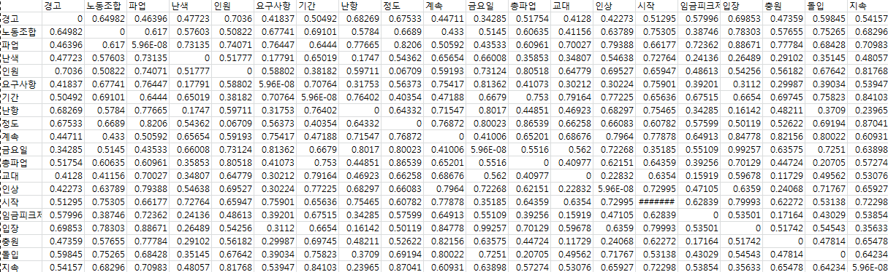

# HiyaSearching

1. 코모란 분석기
-[클릭!](https://github.com/latte-horse/HiyaSearching/tree/master/%EC%BD%94%EB%AA%A8%EB%9E%80)
했더니 위에것은 실패실패......  
파이썬을 통해 코모란 -> word2vec -> 모델 생성 후 분석 3단계로 코딩 완료/

위의 사진 과 같은 결과가 나온다. 일부 같은 값은 0이 나와야 하는데 아닌 값이 나오는 이유는 무엇일까?